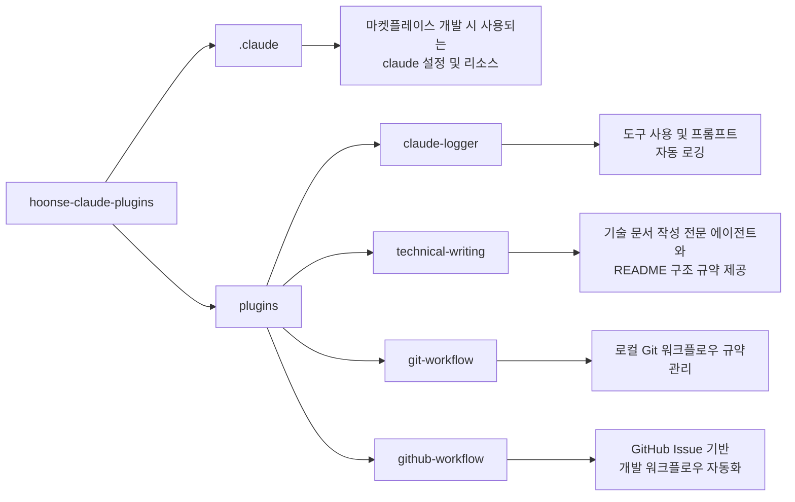

# 🧰 hoonse-claude-plugins

코드 생성 및 코드 설명을 위한 개인용 Claude Code 플러그인 마켓플레이스

## 💁 개요



## 💾 설치 방법

이 마켓플레이스 프로젝트에서 제공하는 플러그인을 사용하려는 프로젝트의 루트 디렉토리에서 아래 명령어를 실행합니다.

### GitHub에서 추가

```bash
# 마켓플레이스 등록
/plugin marketplace add iamhoonse-dev/hoonse-claude-plugins

# 플러그인 설치
/plugin install git-workflow@hoonse-claude-plugins
```

### 로컬 경로에서 추가

```bash
# 마켓플레이스 등록
/plugin marketplace add /path/to/hoonse-claude-plugins

# 플러그인 설치
/plugin install git-workflow@hoonse-claude-plugins
```

## 🧑‍💻 사용 예시

### 📖 Skills

Skills는 `/<plugin-name>:<skill-name>` 형태로 호출합니다.

#### commit-message (git-workflow)

##### with plugin namespace

```
/git-workflow:commit-message
```

##### without plugin namespace

```
/commit-message
```

### 🤖 Agents

Agents는 대화 중 관련 요청 시 자동으로 활성화되거나, 직접 요청할 수 있습니다.

#### auto-committer (git-workflow)

##### with plugin namespace

```
@git-workflow:auto-committer 변경사항을 커밋해 줘
```

##### without plugin namespace

```
변경사항을 커밋해 줘
```

## 🛠️ 플러그인 목록

| 이름 | 설명 |
|------|------|
| [claude-logger](./plugins/claude-logger) | Claude Code 세션의 도구 사용 및 프롬프트를 자동으로 로깅하는 플러그인 |
| [technical-writing](./plugins/technical-writing) | 기술 문서 작성 전문 에이전트와 README 구조 규약을 제공하는 플러그인 |
| [git-workflow](./plugins/git-workflow) | 로컬 Git 워크플로우 규약(커밋 메시지, 브랜치 네이밍 등)을 관리하는 플러그인 |
| [github-workflow](./plugins/github-workflow) | GitHub Issue 기반 개발 워크플로우(이슈 분석, PR 생성 등)를 자동화하는 플러그인 |

## ⚖️ 라이선스

[MIT](LICENSE)
