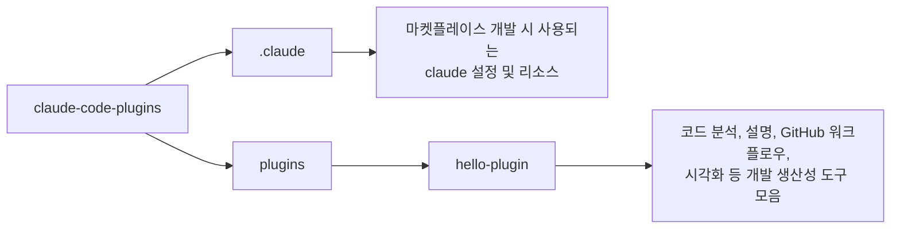

# 🧰 claude-code-plugins

코드 생성 및 코드 설명을 위한 개인용 Claude Code 플러그인 마켓플레이스

## 💁 개요



## 💾 설치 방법

이 마켓플레이스 프로젝트에서 제공하는 플러그인을 사용하려는 프로젝트의 루트 디렉토리에서 아래 명령어를 실행합니다.

```bash
# 마켓플레이스 등록
/plugin marketplace add .

# 플러그인 설치
/plugin install hello-plugin@claude-code-plugins
```

## 🧑‍💻 사용 예시

### 📖 Skills

Skills는 `/hello-plugin:<skill-name>` 형태로 호출합니다.

#### dive-deep

##### with plugin namespace

```
/hello-plugin:dive-deep 인증 모듈의 동작 원리
```

##### without plugin namespace

```
/dive-deep 인증 모듈의 동작 원리
```

### 🤖 Agents

Agents는 대화 중 관련 요청 시 자동으로 활성화되거나, 직접 요청할 수 있습니다.

#### code-improver

##### with plugin namespace

```
@hello-plugin:code-improver 이 파일의 코드를 개선해 줘: src/utils/parser.ts
```

##### without plugin namespace

```
이 파일의 코드를 개선해 줘: src/utils/parser.ts
```

## 🛠️ 플러그인 목록

| 이름 | 설명 |
|------|------|
| [hello-plugin](./plugins/hello-plugin) | 코드 분석, 설명, GitHub 워크플로우, 시각화 등 개발 생산성 도구 모음 (연습/실험용) |

## ⚖️ 라이선스

[MIT](LICENSE)
