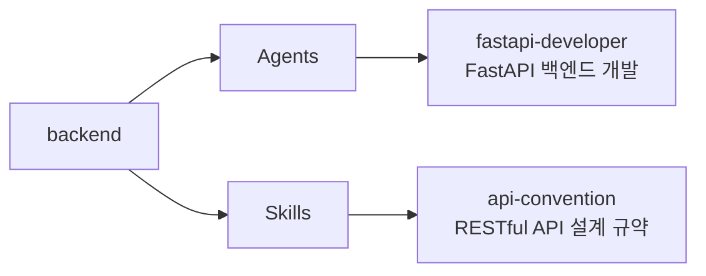

# backend

RESTful API 설계 규약과 FastAPI 백엔드 개발 전문 에이전트를 제공하는 플러그인

## 💁 개요



## 💾 설치 방법

이 플러그인을 사용하려는 프로젝트의 루트 디렉토리에서 아래 명령어를 실행합니다.

### GitHub에서 추가

```bash
# 마켓플레이스 등록
/plugin marketplace add iamhoonse-dev/hoonse-claude-plugins

# 플러그인 설치
/plugin install backend@hoonse-claude-plugins
```

### 로컬 경로에서 추가

```bash
# 마켓플레이스 등록
/plugin marketplace add /path/to/hoonse-claude-plugins

# 플러그인 설치
/plugin install backend@hoonse-claude-plugins
```

## 🧑‍💻 사용 예시

### 📖 Skills

Skills는 `/backend:<skill-name>` 형태로 호출합니다.

#### api-convention

`api-convention` 스킬은 `user-invocable: false`로 설정된 지침형 스킬입니다. `fastapi-developer` 에이전트가 API를 구현할 때 자동으로 참조하며, 직접 호출하지 않아도 됩니다.

##### with plugin namespace

```
/backend:api-convention
```

##### without plugin namespace

```
/api-convention
```

### 🤖 Agents

Agents는 대화 중 관련 요청 시 자동으로 활성화되거나, 직접 요청할 수 있습니다.

#### fastapi-developer

##### with plugin namespace

```
@backend:fastapi-developer 사용자 CRUD API를 만들어줘
```

##### without plugin namespace

```
사용자 CRUD API를 만들어줘
```

## 🛠️ 기능

### 🤖 Agents

| 이름 | 설명 |
|------|------|
| fastapi-developer | API 규약을 참조하여 FastAPI 엔드포인트, Pydantic 스키마, 에러 핸들링 등을 구현합니다. |

### 📖 Skills

| 이름 | 타입 | 설명 |
|------|------|------|
| api-convention | 지침형 | URL 설계, HTTP 메서드, 상태 코드, 요청/응답 형식, 에러 처리, 페이지네이션, 네이밍 규칙 등 RESTful API 설계 규약을 정의합니다. |

## 🔧 커스터마이징

### api-convention 스킬 오버라이딩

`api-convention` 스킬은 기본적으로 범용 RESTful API 설계 규약을 따릅니다. 프로젝트에 맞는 별도의 API 규약이 필요한 경우, 프로젝트 레벨에서 이 스킬을 오버라이딩할 수 있습니다.

프로젝트 루트에 `.claude/skills/api-convention/SKILL.md` 파일을 생성하면 플러그인의 기본 규약을 대체합니다.

```
your-project/
├── .claude/
│   └── skills/
│       └── api-convention/
│           └── SKILL.md    ← 프로젝트 맞춤 API 규약
└── ...
```

**절차:**

1. 프로젝트 루트에 `.claude/skills/api-convention/SKILL.md` 파일 생성
1. 프로젝트에 맞는 API 규약 작성 (URL 패턴, 응답 형식, 에러 코드 등)
1. `fastapi-developer` 에이전트가 자동으로 새 규약을 참조하여 API를 구현

## ⚖️ 라이선스

[MIT](LICENSE)
