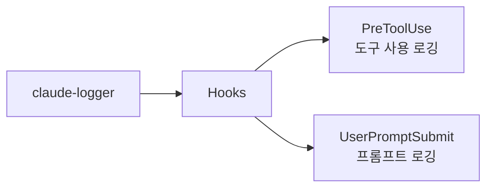

# claude-logger

Claude Code 세션의 도구 사용 및 프롬프트를 자동으로 로깅하는 플러그인

## 💁 개요



## 💾 설치 방법

이 플러그인을 사용하려는 프로젝트의 루트 디렉토리에서 아래 명령어를 실행합니다.

### GitHub에서 추가

```bash
# 마켓플레이스 등록
/plugin marketplace add iamhoonse-dev/hoonse-claude-plugins

# 플러그인 설치
/plugin install claude-logger@hoonse-claude-plugins
```

### 로컬 경로에서 추가

```bash
# 마켓플레이스 등록
/plugin marketplace add /path/to/hoonse-claude-plugins

# 플러그인 설치
/plugin install claude-logger@hoonse-claude-plugins
```

## 🧑‍💻 사용 예시

플러그인 설치 후 별도 설정 없이, Claude Code 사용 시 Hooks가 자동으로 로그를 기록합니다.
로그 파일은 `logs/<git-user>/<session-id>/` 디렉토리에 생성됩니다.

### 도구 사용 로그

Claude가 도구를 사용할 때마다 `tool-use.log` 파일에 자동 기록됩니다.

```log
# logs/hoonse/abc123-def456/tool-use.log

[2026-02-20 14:30:01] [main] [Read] /src/index.ts
[2026-02-20 14:30:05] [main] [Edit] /src/index.ts
[2026-02-20 14:30:12] [main] [Bash] npm test - Run unit tests
[2026-02-20 14:30:15] [main] [Grep] handleError (./src)
```

### 프롬프트 로그

사용자가 프롬프트를 입력할 때마다 `prompt.log` 파일에 자동 기록됩니다.

```log
# logs/hoonse/abc123-def456/prompt.log

[2026-02-20 14:30:00] [main] index.ts 파일에서 에러 처리 로직을 개선해줘
[2026-02-20 14:31:20] [main] 테스트도 실행해줘
```

## 🛠️ 기능

### 🪝 Hooks

| 이벤트 | 설명 |
|--------|------|
| PreToolUse | 도구 사용 내역을 git 사용자, 작업 브랜치, 세션별로 구분하여 로그 파일에 기록합니다. |
| UserPromptSubmit | 사용자 프롬프트를 git 사용자, 작업 브랜치, 세션별로 구분하여 로그 파일에 기록합니다. |

## ⚖️ 라이선스

[MIT](LICENSE)
