# claude-logger

Claude Code 세션의 도구 사용 및 프롬프트를 자동으로 로깅하는 플러그인

## 💁 개요

```mermaid
graph LR
    A[claude-logger] --> B[Hooks]

    B --> B1[PreToolUse<br/>도구 사용 로깅]
    B --> B2[UserPromptSubmit<br/>프롬프트 로깅]
```



## 💾 설치 방법

이 플러그인을 사용하려는 프로젝트의 루트 디렉토리에서 아래 명령어를 실행합니다.

### GitHub에서 추가

```bash
# 마켓플레이스 등록
/plugin marketplace add iamhoonse-dev/hoonse-claude-plugins

# 플러그인 설치
/plugin install claude-logger@hoonse-claude-plugins
```

### 로컬 경로에서 추가

```bash
# 마켓플레이스 등록
/plugin marketplace add /path/to/hoonse-claude-plugins

# 플러그인 설치
/plugin install claude-logger@hoonse-claude-plugins
```

## 🛠️ 기능

### 🪝 Hooks

| 이벤트 | 설명 |
|--------|------|
| PreToolUse | 도구 사용 내역을 git 사용자, 작업 브랜치, 세션별로 구분하여 로그 파일에 기록합니다. |
| UserPromptSubmit | 사용자 프롬프트를 git 사용자, 작업 브랜치, 세션별로 구분하여 로그 파일에 기록합니다. |

## ⚖️ 라이선스

[MIT](LICENSE)
