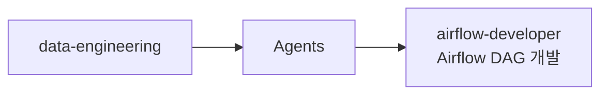

# data-engineering

Apache Airflow DAG 개발 전문 에이전트를 제공하는 데이터 엔지니어링 플러그인

## 💁 개요



## 💾 설치 방법

이 플러그인을 사용하려는 프로젝트의 루트 디렉토리에서 아래 명령어를 실행합니다.

### GitHub에서 추가

```bash
# 마켓플레이스 등록
/plugin marketplace add iamhoonse-dev/hoonse-claude-plugins

# 플러그인 설치
/plugin install data-engineering@hoonse-claude-plugins
```

### 로컬 경로에서 추가

```bash
# 마켓플레이스 등록
/plugin marketplace add /path/to/hoonse-claude-plugins

# 플러그인 설치
/plugin install data-engineering@hoonse-claude-plugins
```

## 🧑‍💻 사용 예시

### 🤖 Agents

Agents는 대화 중 관련 요청 시 자동으로 활성화되거나, 직접 요청할 수 있습니다.

#### airflow-developer

##### with plugin namespace

```
@data-engineering:airflow-developer ETL 파이프라인 DAG를 만들어줘
```

##### without plugin namespace

```
ETL 파이프라인 DAG를 만들어줘
```

## 🛠️ 기능

### 🤖 Agents

| 이름 | 설명 |
|------|------|
| airflow-developer | DAG 정의, 태스크 및 오퍼레이터 추가, 스케줄 설정, 태스크 간 의존성 구성 등 Airflow 모범 사례에 따라 프로덕션 수준의 DAG 코드를 구현합니다. |

## ⚖️ 라이선스

[MIT](LICENSE)
