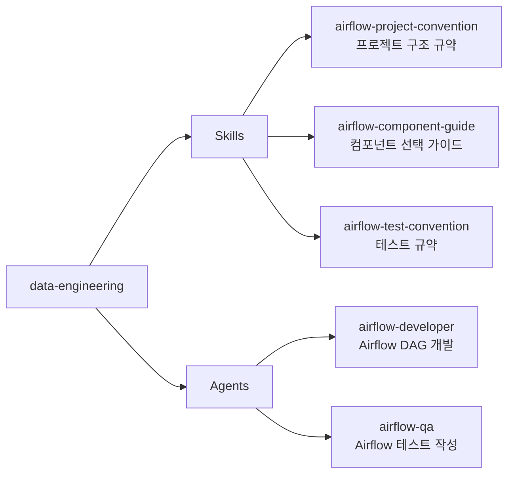

# data-engineering

Apache Airflow v3 DAG 개발을 위한 skills 및 에이전트를 제공하는 데이터 엔지니어링 플러그인

## 💁 개요


```mermaid
graph LR
    A[data-engineering] --> B[Skills]
    A --> C[Agents]

    B --> B1[airflow-project-convention<br/>프로젝트 구조 규약]
    B --> B2[airflow-component-guide<br/>컴포넌트 선택 가이드]
    B --> B3[airflow-test-convention<br/>테스트 규약]

    C --> C1[airflow-developer<br/>Airflow DAG 개발]
    C --> C2[airflow-qa<br/>Airflow 테스트 작성]
```

## 💾 설치 방법

이 플러그인을 사용하려는 프로젝트의 루트 디렉토리에서 아래 명령어를 실행합니다.

### GitHub에서 추가

```bash
# 마켓플레이스 등록
/plugin marketplace add iamhoonse-dev/hoonse-claude-plugins

# 플러그인 설치
/plugin install data-engineering@hoonse-claude-plugins
```

### 로컬 경로에서 추가

```bash
# 마켓플레이스 등록
/plugin marketplace add /path/to/hoonse-claude-plugins

# 플러그인 설치
/plugin install data-engineering@hoonse-claude-plugins
```

## 🧑‍💻 사용 예시

### 🔧 Skills

Skills는 슬래시 명령어로 직접 호출합니다.

#### airflow-project-convention

##### with plugin namespace

```
/data-engineering:airflow-project-convention
```

##### without plugin namespace

```
/airflow-project-convention
```

#### airflow-component-guide

##### with plugin namespace

```
/data-engineering:airflow-component-guide
```

##### without plugin namespace

```
/airflow-component-guide
```

#### airflow-test-convention

##### with plugin namespace

```
/data-engineering:airflow-test-convention
```

##### without plugin namespace

```
/airflow-test-convention
```

### 🤖 Agents

Agents는 대화 중 관련 요청 시 자동으로 활성화되거나, 직접 요청할 수 있습니다.

#### airflow-developer

##### with plugin namespace

```
@data-engineering:airflow-developer ETL 파이프라인 DAG를 만들어줘
```

##### without plugin namespace

```
ETL 파이프라인 DAG를 만들어줘
```

#### airflow-qa

##### with plugin namespace

```
@data-engineering:airflow-qa sales DAG에 대한 테스트를 작성해줘
```

##### without plugin namespace

```
sales DAG에 대한 테스트를 작성해줘
```

## 🛠️ 기능

### 🔧 Skills

| 이름 | 설명 |
|------|------|
| airflow-project-convention | Airflow v3 프로젝트의 디렉토리 구조, 파일 명명 규칙, Python 코딩 규약, 식별자 명명 규칙, 설정 관리 기준을 정의합니다. |
| airflow-component-guide | Airflow v3의 핵심 컴포넌트(DAG, Task, Operator, Hook, Sensor, TaskGroup, Asset, Dynamic Task Mapping)의 역할과 선택 기준을 정의합니다. |
| airflow-test-convention | Airflow v3 프로젝트의 테스트 구조, DAG 구조 테스트, Operator/Hook 단위 테스트, TaskFlow 함수 테스트, 통합 테스트, 공통 fixture 패턴을 정의합니다. |

### 🤖 Agents

| 이름 | 설명 |
|------|------|
| airflow-developer | DAG 정의, 태스크 및 오퍼레이터 추가, 스케줄 설정, 태스크 간 의존성 구성 등 Airflow 모범 사례에 따라 프로덕션 수준의 DAG 코드를 구현합니다. |
| airflow-qa | DAG 구조 테스트, Operator/Hook 단위 테스트, TaskFlow 함수 테스트, 통합 테스트 등 테스트 규약에 따라 Airflow 테스트 코드를 작성하고 검증합니다. |

## ⚖️ 라이선스

[MIT](LICENSE)
