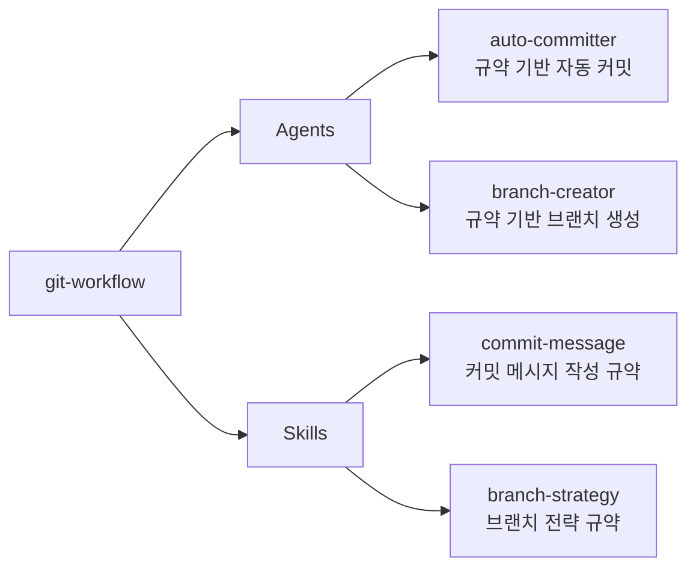

# git-workflow

로컬 Git 워크플로우 규약(커밋 메시지, 브랜치 네이밍 등)을 관리하는 플러그인

## 💁 개요



## 💾 설치 방법

이 플러그인을 사용하려는 프로젝트의 루트 디렉토리에서 아래 명령어를 실행합니다.

### GitHub에서 추가

```bash
# 마켓플레이스 등록
/plugin marketplace add iamhoonse-dev/hoonse-claude-plugins

# 플러그인 설치
/plugin install git-workflow@hoonse-claude-plugins
```

### 로컬 경로에서 추가

```bash
# 마켓플레이스 등록
/plugin marketplace add /path/to/hoonse-claude-plugins

# 플러그인 설치
/plugin install git-workflow@hoonse-claude-plugins
```

## 🧑‍💻 사용 예시

### 🤖 Agents

Agents는 대화 중 관련 요청 시 자동으로 활성화되거나, 직접 요청할 수 있습니다.

#### auto-committer

##### with plugin namespace

```
@git-workflow:auto-committer 변경사항 커밋해줘
```

##### without plugin namespace

```
변경사항 커밋해줘
```

#### branch-creator

##### with plugin namespace

```
@git-workflow:branch-creator 브랜치 만들어줘
```

##### without plugin namespace

```
브랜치 만들어줘
```

### 📖 Skills

Skills는 `/git-workflow:<skill-name>` 형태로 호출합니다.

#### commit-message

`commit-message` 스킬은 `user-invocable: false`로 설정된 지침형 스킬입니다. Claude가 커밋 메시지를 작성할 때 자동으로 참조하며, 직접 호출하지 않아도 됩니다.

##### with plugin namespace

```
/git-workflow:commit-message
```

##### without plugin namespace

```
/commit-message
```

## 🛠️ 기능

### 🤖 Agents

| 이름 | 설명 |
|------|------|
| auto-committer | 스테이징된 변경 사항을 분석하고 프로젝트의 커밋 메시지 규약에 따라 메시지를 작성한 뒤 자동으로 커밋합니다. |
| branch-creator | 프로젝트의 브랜치 전략 규약을 읽고, 사용자의 작업 의도에 맞는 브랜치를 자동으로 생성합니다. |

### 📖 Skills

| 이름 | 타입 | 설명 |
|------|------|------|
| commit-message | 지침형 | Conventional Commits v1.0.0 기반의 커밋 메시지 작성 규약을 정의합니다. 한국어 description, 명사형 종결, 72자 제한 등의 규칙을 포함합니다. |
| branch-strategy | 지침형 | trunk-based development 기반의 브랜치 전략을 정의합니다. 브랜치 이름 규칙, 허용 타입, 작업 흐름 등을 포함합니다. |

## 🔧 커스터마이징

### branch-strategy 스킬 오버라이딩

`branch-strategy` 스킬은 기본적으로 trunk-based development 전략을 따릅니다. 프로젝트에 맞는 별도의 브랜치 전략이 필요한 경우, 프로젝트 레벨에서 이 스킬을 오버라이딩할 수 있습니다.

프로젝트 루트에 `.claude/skills/branch-strategy/SKILL.md` 파일을 생성하면 플러그인의 기본 전략을 대체합니다.

```
your-project/
├── .claude/
│   └── skills/
│       └── branch-strategy/
│           └── SKILL.md    ← 프로젝트 맞춤 브랜치 전략
└── ...
```

**절차:**

1. 프로젝트 루트에 `.claude/skills/branch-strategy/SKILL.md` 파일 생성
1. 프로젝트에 맞는 브랜치 전략 작성 (브랜치 유형, 이름 규칙, 작업 흐름 등)
1. `branch-creator` 에이전트가 자동으로 새 규약을 참조하여 브랜치를 생성

## ⚖️ 라이선스

[MIT](LICENSE)
