# git-workflow

로컬 Git 워크플로우 규약(커밋 메시지, 브랜치 네이밍 등)을 관리하는 플러그인

## 💁 개요

```mermaid
graph LR
    A[git-workflow] --> C[Agents]
    A --> D[Skills]

    C --> C1[auto-committer<br/>규약 기반 자동 커밋]

    D --> D1[commit-message<br/>커밋 메시지 작성 규약]
```



## 💾 설치 방법

이 플러그인을 사용하려는 프로젝트의 루트 디렉토리에서 아래 명령어를 실행합니다.

### GitHub에서 추가

```bash
# 마켓플레이스 등록
/plugin marketplace add iamhoonse-dev/hoonse-claude-plugins

# 플러그인 설치
/plugin install git-workflow@hoonse-claude-plugins
```

### 로컬 경로에서 추가

```bash
# 마켓플레이스 등록
/plugin marketplace add /path/to/hoonse-claude-plugins

# 플러그인 설치
/plugin install git-workflow@hoonse-claude-plugins
```

## 🧑‍💻 사용 예시

### 🤖 Agents

Agents는 대화 중 관련 요청 시 자동으로 활성화되거나, 직접 요청할 수 있습니다.

#### auto-committer

##### with plugin namespace

```
@git-workflow:auto-committer 변경사항 커밋해줘
```

##### without plugin namespace

```
변경사항 커밋해줘
```

### 📖 Skills

Skills는 `/git-workflow:<skill-name>` 형태로 호출합니다.

#### commit-message

`commit-message` 스킬은 `user-invocable: false`로 설정된 지침형 스킬입니다. Claude가 커밋 메시지를 작성할 때 자동으로 참조하며, 직접 호출하지 않아도 됩니다.

##### with plugin namespace

```
/git-workflow:commit-message
```

##### without plugin namespace

```
/commit-message
```

## 🛠️ 기능

### 🤖 Agents

| 이름 | 설명 |
|------|------|
| auto-committer | 스테이징된 변경 사항을 분석하고 프로젝트의 커밋 메시지 규약에 따라 메시지를 작성한 뒤 자동으로 커밋합니다. |

### 📖 Skills

| 이름 | 타입 | 설명 |
|------|------|------|
| commit-message | 지침형 | Conventional Commits v1.0.0 기반의 커밋 메시지 작성 규약을 정의합니다. 한국어 description, 명사형 종결, 72자 제한 등의 규칙을 포함합니다. |

## ⚖️ 라이선스

[MIT](LICENSE)
