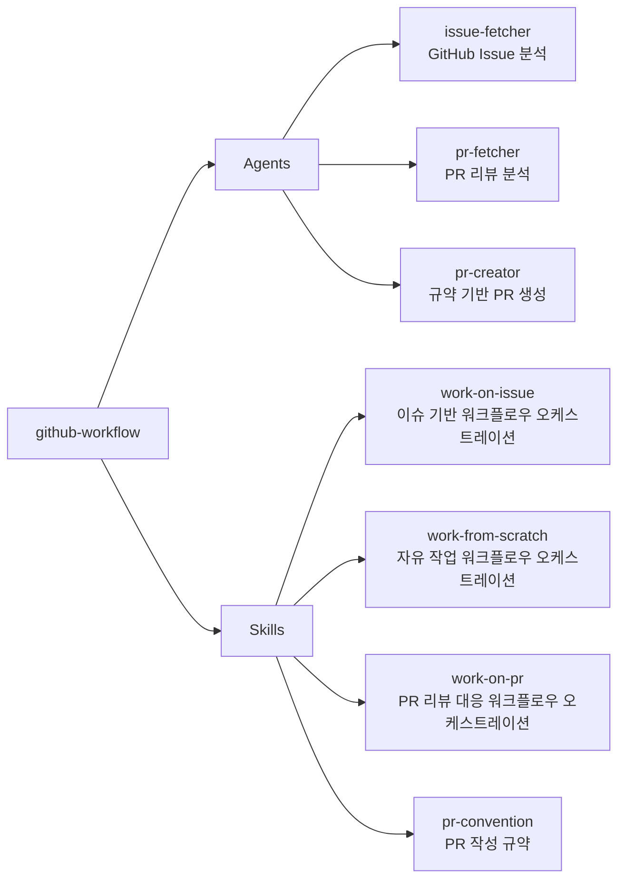

# github-workflow

GitHub 개발 워크플로우(이슈 기반 작업, 자유 작업, PR 생성 등)를 자동화하는 플러그인

## 💁 개요



> **의존성**: 이 플러그인은 `git-workflow` 플러그인의 `branch-creator`, `auto-committer` 에이전트를 활용합니다. `git-workflow` 플러그인이 함께 설치되어 있어야 전체 워크플로우가 정상 동작합니다.

> **필수 도구**: GitHub CLI(`gh`)가 설치되고 인증된 상태여야 합니다. (`brew install gh` → `gh auth login`)

## 💾 설치 방법

이 플러그인을 사용하려는 프로젝트의 루트 디렉토리에서 아래 명령어를 실행합니다.

### GitHub에서 추가

```bash
# 마켓플레이스 등록
/plugin marketplace add iamhoonse-dev/hoonse-claude-plugins

# 플러그인 설치 (git-workflow 의존성 포함)
/plugin install git-workflow@hoonse-claude-plugins
/plugin install github-workflow@hoonse-claude-plugins
```

### 로컬 경로에서 추가

```bash
# 마켓플레이스 등록
/plugin marketplace add /path/to/hoonse-claude-plugins

# 플러그인 설치 (git-workflow 의존성 포함)
/plugin install git-workflow@hoonse-claude-plugins
/plugin install github-workflow@hoonse-claude-plugins
```

## 🧑‍💻 사용 예시

### 📖 Skills

Skills는 `/github-workflow:<skill-name>` 형태로 호출합니다.

#### work-on-issue

##### with plugin namespace

```
/github-workflow:work-on-issue 42
```

##### without plugin namespace

```
/work-on-issue 42
```

#### work-from-scratch

##### with plugin namespace

```
/github-workflow:work-from-scratch 로그인 페이지에 다크 모드 토글 추가
```

##### without plugin namespace

```
/work-from-scratch 로그인 페이지에 다크 모드 토글 추가
```

#### work-on-pr

##### with plugin namespace

```
/github-workflow:work-on-pr 42
```

##### without plugin namespace

```
/work-on-pr 42
```

### 🤖 Agents

Agents는 대화 중 관련 요청 시 자동으로 활성화되거나, 직접 요청할 수 있습니다.

#### pr-creator

##### with plugin namespace

```
@github-workflow:pr-creator PR 만들어줘
```

##### without plugin namespace

```
PR 만들어줘
```

#### pr-fetcher

##### with plugin namespace

```
@github-workflow:pr-fetcher PR #42 리뷰 분석해줘
```

##### without plugin namespace

```
PR #42 리뷰 분석해줘
```

## 🛠️ 기능

### 📖 Skills

| 이름 | 타입 | 설명 |
|------|------|------|
| work-on-issue | 직접 호출형 | GitHub Issue 번호를 받아 이슈 분석 → 브랜치 생성 → 계획 수립 → 구현 → 푸시 → PR 생성까지 전체 워크플로우를 단계별로 오케스트레이션합니다. |
| work-from-scratch | 직접 호출형 | Issue 없이 작업 설명을 받아 작업 정의 → 브랜치 생성 → 계획 수립 → 구현 → 푸시 → PR 생성까지 전체 워크플로우를 단계별로 오케스트레이션합니다. |
| work-on-pr | 직접 호출형 | PR 번호를 받아 리뷰 분석 → 브랜치 체크아웃 → 계획 수립 → 구현 → 푸시 → PR 코멘트까지 전체 리뷰 대응 워크플로우를 단계별로 오케스트레이션합니다. |
| pr-convention | 지침형 | PR 제목/본문 작성 규약을 정의합니다. Conventional Commits 기반의 제목 형식, 한국어 명사형, 72자 제한 등의 규칙을 포함합니다. |

### 🤖 Agents

| 이름 | 설명 |
|------|------|
| issue-fetcher | GitHub Issue의 상세 정보를 `gh` CLI로 조회하고, 상태/라벨/핵심 요구사항/작업 유형을 구조화된 요약으로 반환합니다. |
| pr-fetcher | GitHub PR의 리뷰 정보를 `gh` CLI로 조회하고, 리뷰 결정/인라인 코멘트(파일별 그룹)/일반 토론을 구조화된 요약으로 반환합니다. |
| pr-creator | 브랜치의 변경 사항을 분석하고, PR 규약에 따라 제목과 본문을 작성한 뒤 `gh pr create`로 PR을 생성합니다. |

## ⚖️ 라이선스

[MIT](LICENSE)
