# hello-plugin

코드 분석, 설명, GitHub 워크플로우, 시각화 등 개발 생산성 도구 모음 (연습/실험용)

## 💁 개요

```mermaid
graph LR
    A[hello-plugin] --> C[Agents]
    A --> D[Skills]

    C --> C1[code-improver<br/>코드 품질 개선]

    D --> D1[dive-deep<br/>주제 심층 연구]
    D --> D2[explain-code<br/>코드 시각적 설명]
    D --> D3[fix-issue<br/>GitHub 이슈 수정]
    D --> D4[summarize-pr<br/>PR 요약]
    D --> D5[visualize-codebase<br/>코드베이스 시각화]
```



## 💾 설치 방법

이 플러그인을 사용하려는 프로젝트의 루트 디렉토리에서 아래 명령어를 실행합니다.

### GitHub에서 추가

```bash
# 마켓플레이스 등록
/plugin marketplace add iamhoonse-dev/hoonse-claude-plugins

# 플러그인 설치
/plugin install hello-plugin@hoonse-claude-plugins
```

### 로컬 경로에서 추가

```bash
# 마켓플레이스 등록
/plugin marketplace add /path/to/hoonse-claude-plugins

# 플러그인 설치
/plugin install hello-plugin@hoonse-claude-plugins
```

## 🧑‍💻 사용 예시

### 📖 Skills

Skills는 `/hello-plugin:<skill-name>` 형태로 호출합니다.

#### dive-deep

##### with plugin namespace

```
/hello-plugin:dive-deep 인증 모듈의 동작 원리
```

##### without plugin namespace

```
/dive-deep 인증 모듈의 동작 원리
```

### 🤖 Agents

Agents는 대화 중 관련 요청 시 자동으로 활성화되거나, 직접 요청할 수 있습니다.

#### code-improver

##### with plugin namespace

```
@hello-plugin:code-improver 이 파일의 코드를 개선해 줘: src/utils/parser.ts
```

##### without plugin namespace

```
이 파일의 코드를 개선해 줘: src/utils/parser.ts
```

## 🛠️ 기능

### 📖 Skills

| 이름 | 타입 | 설명 |
|------|------|------|
| dive-deep | fork / Explore | 주제를 철저히 연구합니다. Glob 및 Grep을 사용하여 관련 파일을 찾고, 코드를 분석하며, 근거 자료와 함께 결과를 요약합니다. |
| explain-code | inline | 시각적 다이어그램과 유추를 사용하여 코드를 설명합니다. Mermaid 차트로 흐름과 구조를 시각화하고, 단계별로 코드를 설명합니다. |
| fix-issue | inline | GitHub 이슈를 읽고 요구사항을 파악하여 코딩 표준에 따라 수정을 구현하고, 테스트 작성 후 커밋합니다. |
| summarize-pr | fork / Explore | 풀 요청의 diff, 댓글, 변경된 파일을 분석하여 변경 사항을 요약합니다. |
| visualize-codebase | inline | 코드베이스의 파일 구조를 축소 가능한 디렉토리로 보여주는 대화형 HTML 트리 뷰를 생성합니다. |

### 🤖 Agents

| 이름 | 설명 |
|------|------|
| code-improver | 기존 코드를 가독성, 성능, 모범 사례 관점에서 분석하고 구조화된 개선 제안을 제공합니다. |

## ⚖️ 라이선스

[MIT](LICENSE)
