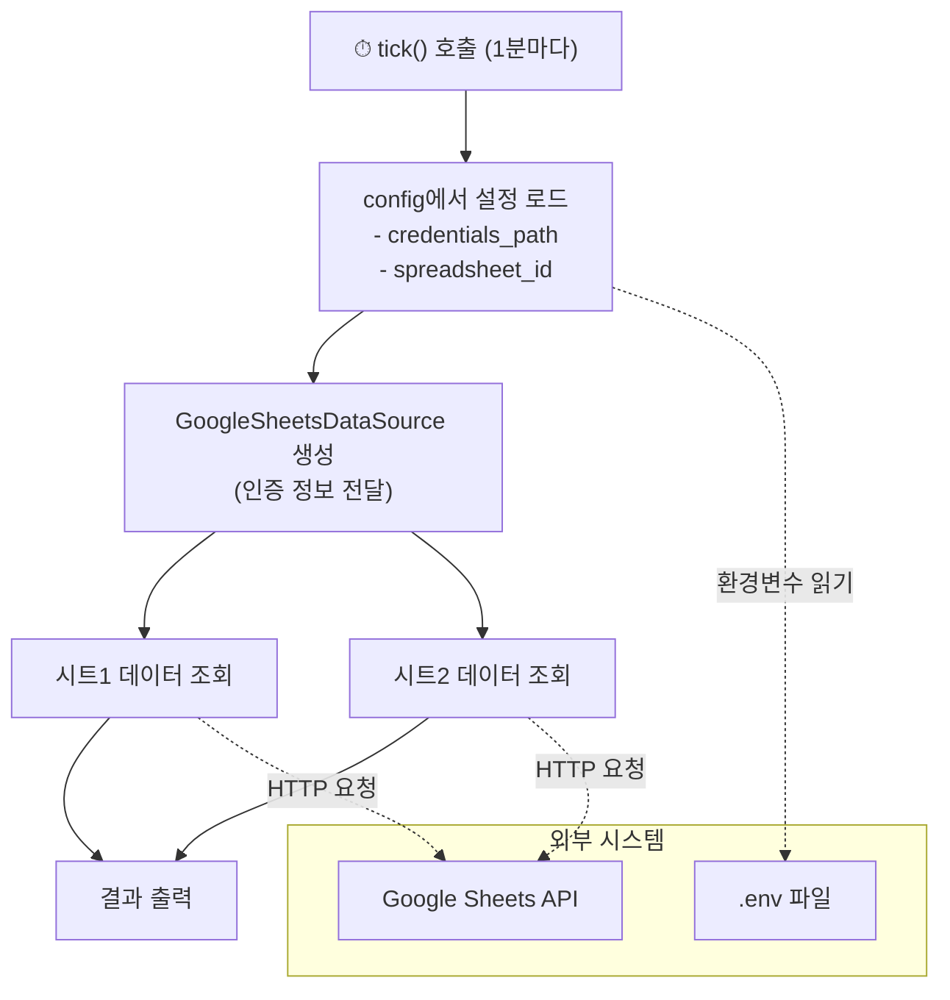

## 1. 유추: 신문 배달부
                                                                                                                                                                                      
이 코드는 매일 아침 신문을 가져오는 배달부와 같습니다.
                                                                                                                                                                                      
- 배달부의 신분증 = Google Sheets 인증 정보 (credentials_path)                                                                                                                      
- 배달할 집 주소 = 스프레드시트 ID (spreadsheet_id)
- 신문의 각 섹션 = 워크시트 (시트1, 시트2)
- 1분마다 새 신문 확인 = tick() 함수의 주기적 실행

배달부가 신분증을 들고 → 특정 집(스프레드시트)에 가서 → 각 섹션(시트)의 내용을 가져오는 구조입니다.

## 2. 다이어그램



## 3. 코드 단계별 설명

### (1) 설정 가져오기 (Line 1)

```python
from src.common.config import config
```

.env 파일에서 환경변수를 읽어 싱글톤 config 객체를 가져옵니다. 여기에 Google 인증 파일 경로와 스프레드시트 ID가 들어 있습니다.

### (2) 데이터 소스 클래스 가져오기 (Line 2)

```python
from src.core.data_source.GoogleSheetsDataSource import GoogleSheetsDataSource
```

Google Sheets에서 데이터를 읽어오는 클래스를 임포트합니다. 이 클래스는 내부적으로 서비스 계정 인증, ETag 캐싱(5분 TTL), URL/ID 자동 감지 등을 처리합니다.

### (3) 데이터 소스 인스턴스 생성 (Line 11)

```python
ds = GoogleSheetsDataSource(credentials_path=config.google_sheets_credentials_path)
```

인증 정보를 넘겨서 Google Sheets 클라이언트를 만듭니다. 실제 인증은 lazy initialization으로, 데이터를 처음 요청할 때 수행됩니다.

### (4) 데이터 조회 (Lines 14-15)

```python
sheet1 = ds.get_data(query=config.google_sheets_spreadsheet_id, worksheet="시트1")
sheet2 = ds.get_data(query=config.google_sheets_spreadsheet_id, worksheet="시트2")
```

같은 스프레드시트의 서로 다른 워크시트에서 데이터를 가져옵니다. 첫 번째 행이 헤더로 사용되어 딕셔너리 리스트로 반환됩니다.

### (5) 결과 출력 (Lines 17-18)

```python
print("Sheet1 Data:", sheet1)
print("Sheet2 Data:", sheet2)
```

## 4. 주의할 점

### (1) tick()은 스케줄러가 아닙니다

이 함수 자체는 반복 실행 로직이 없습니다. 외부 스케줄러(cron, APScheduler 등)가 1분마다 호출해야 합니다.

### (2) 에러 처리 부재

네트워크 오류, 인증 실패, 시트 미존재 등의 예외 처리가 없습니다. 프로덕션에서는 try/except가 필요합니다.

### (3) 매번 새 인스턴스 생성

tick()이 호출될 때마다 GoogleSheetsDataSource를 새로 만듭니다. 내부 ETag 캐시가 인스턴스에 귀속되므로, 매번 새로 만들면 캐싱 효과를 잃을 수 있습니다.

### (4) print 디버깅

현재 print로 출력하고 있지만, 실제 운영 환경에서는 logging 모듈이나 메트릭 전송 로직으로 교체해야 합니다.
