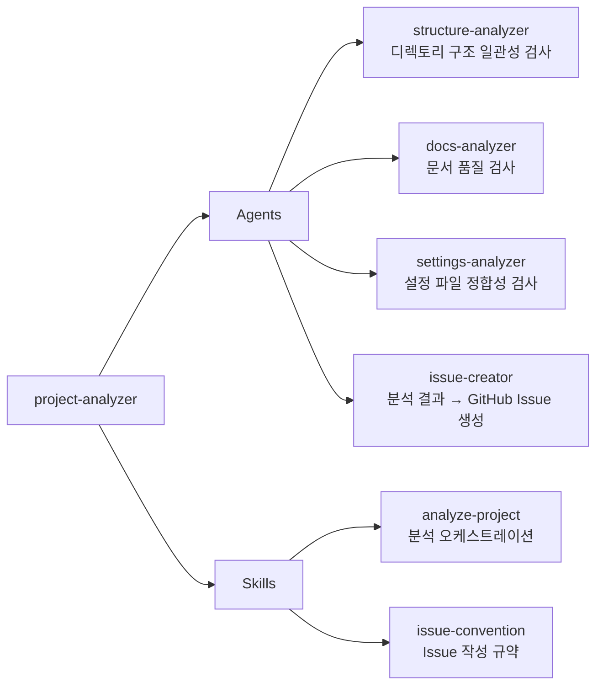

# project-analyzer

플러그인 마켓플레이스 프로젝트의 구조 일관성, 문서 품질, 설정 정합성을 자동 분석하고 GitHub Issue로 등록하는 플러그인

## 💁 개요



> **의존성**: 이 플러그인은 `technical-writing` 플러그인의 `plugin-readme-structure` 스킬을 참조합니다. `technical-writing` 플러그인이 함께 설치되어 있으면 문서 품질 검사가 더 정확합니다.

> **필수 도구**: GitHub CLI(`gh`)가 설치되고 인증된 상태여야 이슈 생성 기능을 사용할 수 있습니다. (`brew install gh` → `gh auth login`)

## 💾 설치 방법

이 플러그인을 사용하려는 프로젝트의 루트 디렉토리에서 아래 명령어를 실행합니다.

### GitHub에서 추가

```bash
# 마켓플레이스 등록
/plugin marketplace add iamhoonse-dev/hoonse-claude-plugins

# 플러그인 설치
/plugin install project-analyzer@hoonse-claude-plugins
```

### 로컬 경로에서 추가

```bash
# 마켓플레이스 등록
/plugin marketplace add /path/to/hoonse-claude-plugins

# 플러그인 설치
/plugin install project-analyzer@hoonse-claude-plugins
```

## 🧑‍💻 사용 예시

### 📖 Skills

Skills는 `/project-analyzer:<skill-name>` 형태로 호출합니다.

#### analyze-project

##### with plugin namespace

```
/project-analyzer:analyze-project
```

##### without plugin namespace

```
/analyze-project
```

##### 특정 플러그인만 분석

```
/analyze-project git-workflow
```

##### 특정 카테고리만 분석

```
/analyze-project structure
```

### 🤖 Agents

Agents는 대화 중 관련 요청 시 자동으로 활성화되거나, 직접 요청할 수 있습니다.

#### issue-creator

##### with plugin namespace

```
@project-analyzer:issue-creator 분석 결과를 이슈로 등록해줘
```

##### without plugin namespace

```
분석 결과를 이슈로 등록해줘
```

## 🛠️ 기능

### 📖 Skills

| 이름 | 타입 | 설명 |
|------|------|------|
| analyze-project | 직접 호출형 | 분석 범위 결정 → 에이전트 병렬 호출 → 종합 리포트 → 선택적 이슈 생성까지의 전체 분석 워크플로우를 오케스트레이션합니다. |
| issue-convention | 지식형 | project-analyzer가 생성하는 GitHub Issue의 제목 형식, 본문 템플릿, 그룹핑 정책, 라벨 규칙을 정의합니다. |

### 🤖 Agents

| 이름 | 설명 |
|------|------|
| structure-analyzer | 플러그인 디렉토리의 필수 파일 존재 여부, SKILL.md/Agent 프론트매터 유효성, kebab-case 네이밍 규약을 검사합니다. |
| docs-analyzer | README 필수 섹션, Mermaid 다이어그램, 실제 구성 요소와 문서 내용의 일치 여부를 검사합니다. |
| settings-analyzer | plugin.json↔marketplace.json 일치, settings.json 등록, Issue/PR 템플릿 드롭다운 포함 여부를 검사합니다. |
| issue-creator | 분석 결과를 issue-convention 규약에 따라 GitHub Issue로 변환합니다. 중복 체크, 그룹핑, 개발자 확인을 포함합니다. |

## ⚖️ 라이선스

[MIT](LICENSE)
