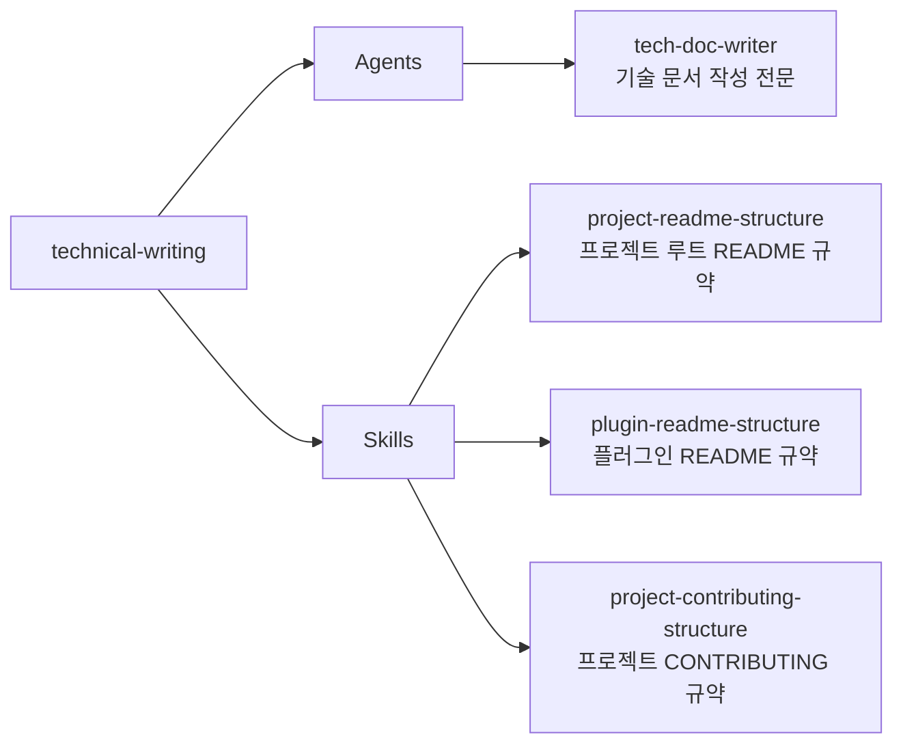

# technical-writing

기술 문서 작성 전문 에이전트와 README 구조 규약을 제공하는 플러그인

## 💁 개요


```mermaid
graph LR
    A[technical-writing] --> C[Agents]
    A --> D[Skills]

    C --> C1[tech-doc-writer<br/>기술 문서 작성 전문]

    D --> D1[project-readme-structure<br/>프로젝트 루트 README 규약]
    D --> D2[plugin-readme-structure<br/>플러그인 README 규약]
    D --> D3[project-contributing-structure<br/>프로젝트 CONTRIBUTING 규약]
```

## 💾 설치 방법

이 플러그인을 사용하려는 프로젝트의 루트 디렉토리에서 아래 명령어를 실행합니다.

### GitHub에서 추가

```bash
# 마켓플레이스 등록
/plugin marketplace add iamhoonse-dev/hoonse-claude-plugins

# 플러그인 설치
/plugin install technical-writing@hoonse-claude-plugins
```

### 로컬 경로에서 추가

```bash
# 마켓플레이스 등록
/plugin marketplace add /path/to/hoonse-claude-plugins

# 플러그인 설치
/plugin install technical-writing@hoonse-claude-plugins
```

## 🧑‍💻 사용 예시

### 📖 Skills

이 플러그인의 모든 스킬은 `user-invocable: false`로 설정된 지침형 스킬입니다. 직접 호출하지 않아도 에이전트가 관련 문서를 작성할 때 자동으로 참조합니다.

### 🤖 Agents

Agents는 대화 중 관련 요청 시 자동으로 활성화되거나, 직접 요청할 수 있습니다.

#### tech-doc-writer

##### with plugin namespace

```
@technical-writing:tech-doc-writer README 파일을 작성해 줘
```

##### without plugin namespace

```
README 파일을 작성해 줘
```

## 🛠️ 기능

### 📖 Skills

| 이름 | 타입 | 설명 |
|------|------|------|
| project-readme-structure | 지침형 | 마켓플레이스 프로젝트 루트 README.md의 필수 섹션, 다이어그램 작성 방식, 언어 규칙 등 작성 규약을 정의합니다. |
| plugin-readme-structure | 지침형 | 개별 플러그인 README.md의 필수 섹션, 설치 명령어 형식, 기능 목록 작성 형식 등 작성 규약을 정의합니다. |
| project-contributing-structure | 지침형 | 프로젝트 CONTRIBUTING.md의 필수 섹션, 개발 환경 구성, 기여 절차 등 작성 규약을 정의합니다. |

### 🤖 Agents

| 이름 | 설명 |
|------|------|
| tech-doc-writer | README, GitHub Issue, PR 설명, 변경 이력 등 다양한 마크다운 기술 문서를 프로젝트 규약에 따라 작성·수정합니다. |

## 🔧 커스터마이징

### project-readme-structure 스킬 오버라이딩

`project-readme-structure` 스킬은 기본적으로 마켓플레이스 프로젝트 루트 README의 필수 섹션, 다이어그램 작성 방식 등을 정의합니다. 프로젝트에 맞는 별도의 규약이 필요한 경우, 프로젝트 레벨에서 이 스킬을 오버라이딩할 수 있습니다.

프로젝트 루트에 `.claude/skills/project-readme-structure/SKILL.md` 파일을 생성하면 플러그인의 기본 규약을 대체합니다.

```
your-project/
├── .claude/
│   └── skills/
│       └── project-readme-structure/
│           └── SKILL.md    ← 프로젝트 맞춤 루트 README 규약
└── ...
```

**절차:**

1. 프로젝트 루트에 `.claude/skills/project-readme-structure/SKILL.md` 파일 생성
1. 프로젝트에 맞는 규약 작성 (필수 섹션, 다이어그램 형식, 언어 규칙 등)
1. `tech-doc-writer` 에이전트가 자동으로 새 규약을 참조하여 문서 작성

### plugin-readme-structure 스킬 오버라이딩

`plugin-readme-structure` 스킬은 기본적으로 플러그인 README의 필수 섹션, 설치 명령어 형식 등을 정의합니다. 프로젝트에 맞는 별도의 규약이 필요한 경우, 프로젝트 레벨에서 이 스킬을 오버라이딩할 수 있습니다.

프로젝트 루트에 `.claude/skills/plugin-readme-structure/SKILL.md` 파일을 생성하면 플러그인의 기본 규약을 대체합니다.

```
your-project/
├── .claude/
│   └── skills/
│       └── plugin-readme-structure/
│           └── SKILL.md    ← 프로젝트 맞춤 플러그인 README 규약
└── ...
```

**절차:**

1. 프로젝트 루트에 `.claude/skills/plugin-readme-structure/SKILL.md` 파일 생성
1. 프로젝트에 맞는 규약 작성 (필수 섹션, 설치 명령어 형식, 기능 목록 형식 등)
1. `tech-doc-writer` 에이전트가 자동으로 새 규약을 참조하여 문서 작성

### project-contributing-structure 스킬 오버라이딩

`project-contributing-structure` 스킬은 기본적으로 프로젝트 CONTRIBUTING.md의 필수 섹션, 개발 환경 구성 등을 정의합니다. 프로젝트에 맞는 별도의 규약이 필요한 경우, 프로젝트 레벨에서 이 스킬을 오버라이딩할 수 있습니다.

프로젝트 루트에 `.claude/skills/project-contributing-structure/SKILL.md` 파일을 생성하면 플러그인의 기본 규약을 대체합니다.

```
your-project/
├── .claude/
│   └── skills/
│       └── project-contributing-structure/
│           └── SKILL.md    ← 프로젝트 맞춤 CONTRIBUTING 규약
└── ...
```

**절차:**

1. 프로젝트 루트에 `.claude/skills/project-contributing-structure/SKILL.md` 파일 생성
1. 프로젝트에 맞는 규약 작성 (필수 섹션, 개발 환경 구성, 기여 절차 등)
1. `tech-doc-writer` 에이전트가 자동으로 새 규약을 참조하여 문서 작성

## ⚖️ 라이선스

[MIT](LICENSE)
